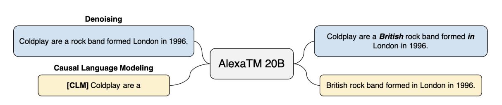

### Module 3: Alexa TM In-Context Learning via Prompt Engineering
This module explores N-shot learning via in-context learning and demonstrates how to use AlexaTM Large Language Model (LLM) to perform natural language understanding (NLU) tasks using zero, one, and few-shot learning. In this module, you will learn how to leverage AlexaTM LLM to improve the performance of virtual assistants by personalizing their responses to users.

    

