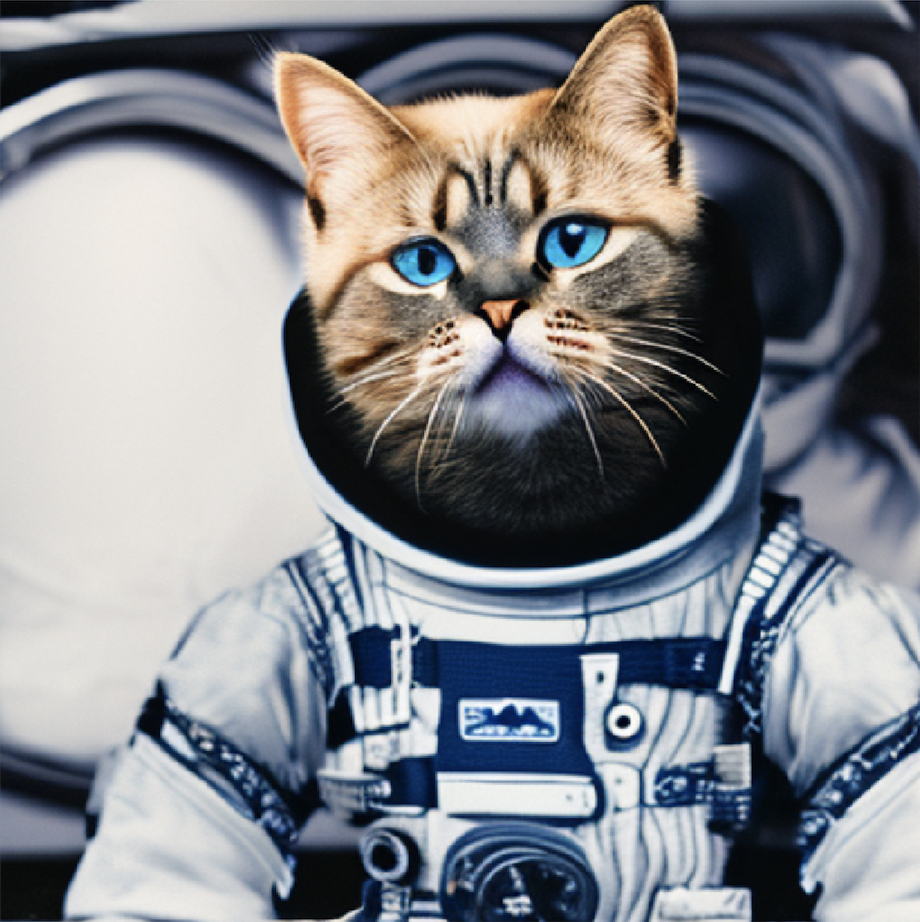
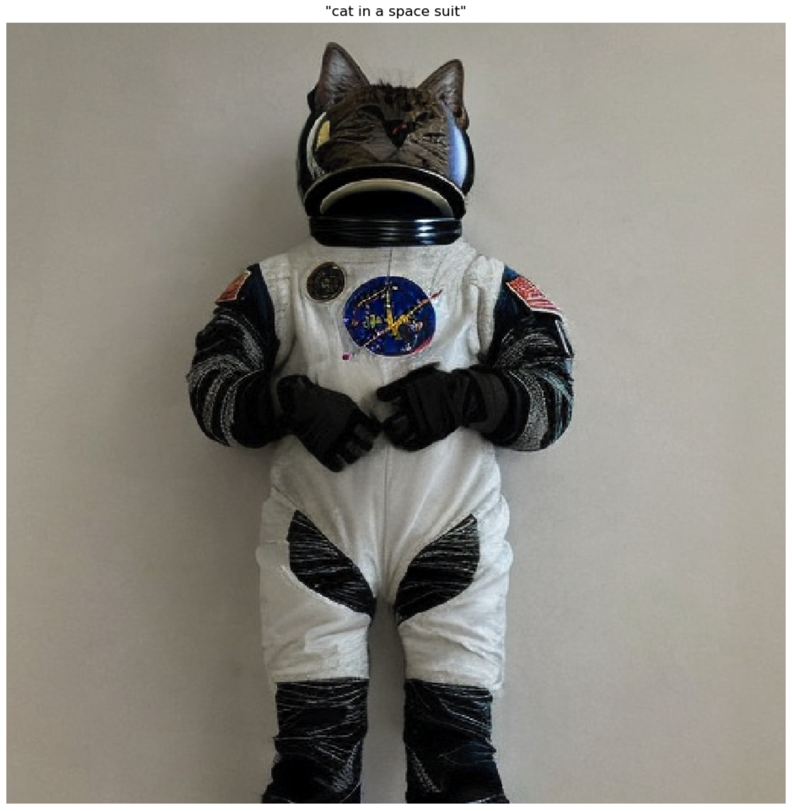
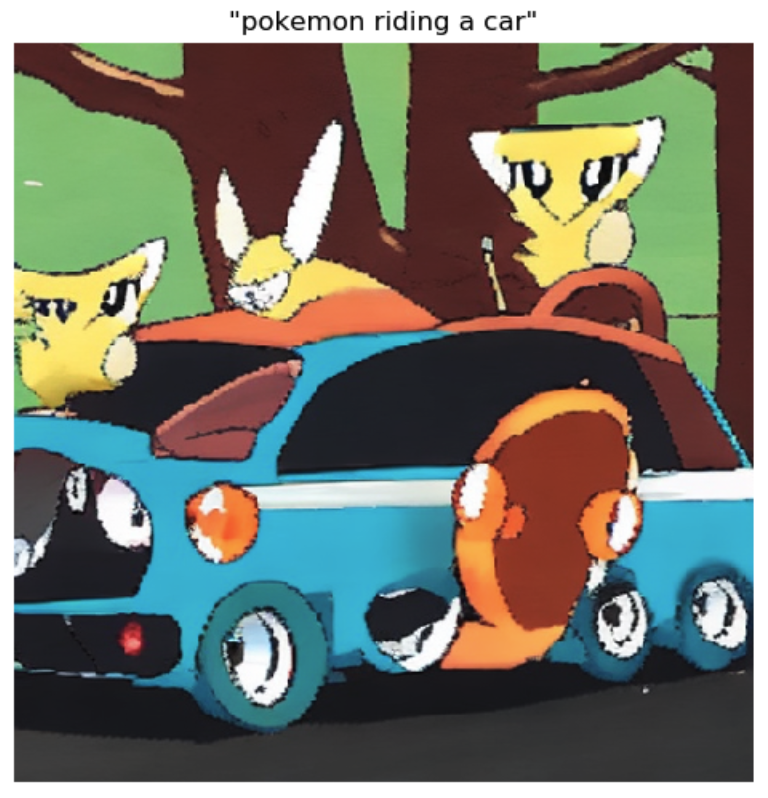
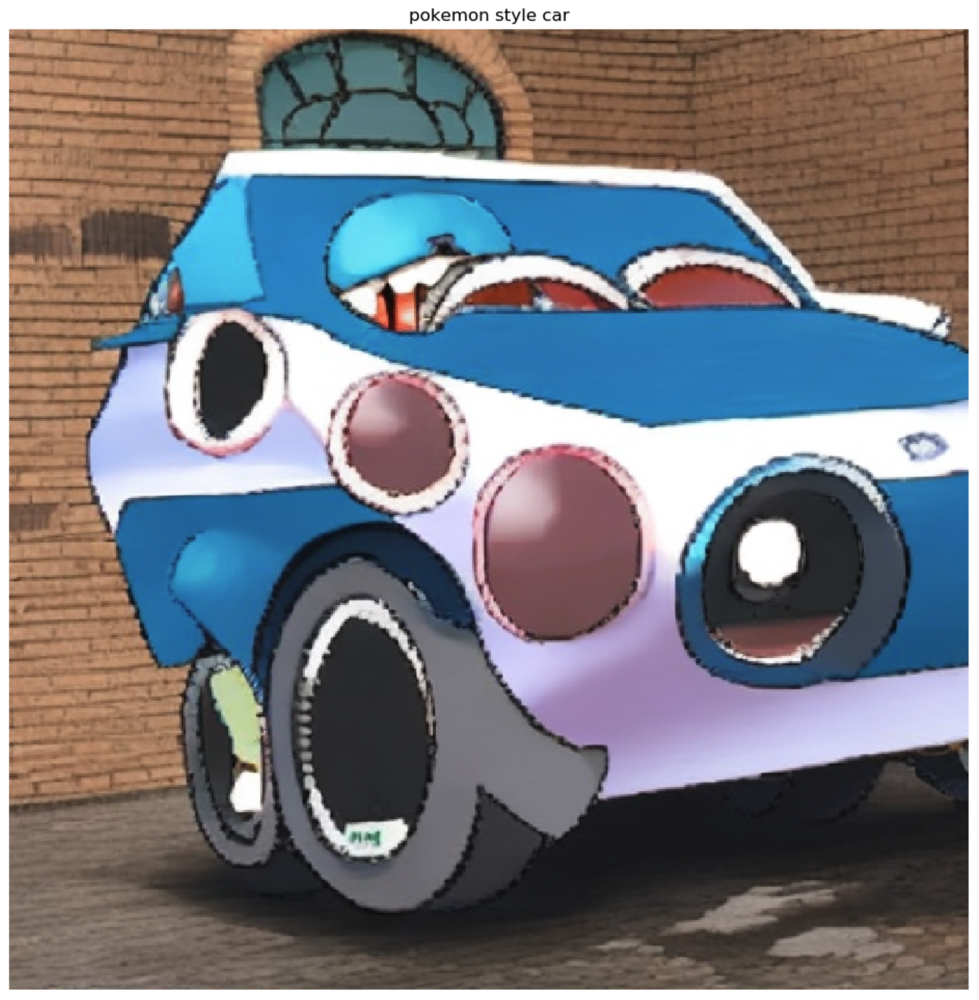

## Jumpstart Generative AI Examples
This repository contains code examples for **SageMaker Jumpstart** Generative AI, a tutorial series designed to help users get started with generative AI using Python and PyTorch.

### Module 1: Stable Diffusion with Small Dataset of Cat Images
This repository showcases the Stable Diffusion technique, a powerful generative modeling technique that allows for the creation of high-quality images from small datasets. The repository consists of two Jupyter notebooks.

The first notebook, `01-txt2img-gen.ipynb`, demonstrates how to easily create a SageMaker endpoint for the pre-trained Stable Diffusion model and generate cat images based on user prompts. Users can input fun scenarios and prompts to generate various cat images.

    
    

 
The second notebook, `02-finetune.ipynb`, showcases the process of fine-tuning the Stable Diffusion model with a small set of images. This approach involves using images of cats from specific breeds or your own pet cats to teach the model how to recreate these images and incorporate them into various creative scenarios. This technique can be adapted to work with any set of images containing fewer than ten examples, such as images of pet dogs or other entities.

By following the steps outlined in the notebook, you can collect a few images of your chosen entity from Google Images and utilize the fine-tuning process to train the Stable Diffusion model to create new and unique compositions. This approach offers a broad range of creative possibilities, allowing you to experiment with various scenarios and unleash your imagination.

    
    

Overall, this repository provides users with a powerful tool for generating high-quality images, even with limited datasets. The Stable Diffusion technique offers a versatile and efficient way to create customized and imaginative images.

### Module 2: Stable Diffusion with Large Dataset of Pokemon Images
In this module, we show how Stable Diffusion can be used to generate high-quality images from large datasets. Here, we use a dataset of Pokemon images to demonstrate how to fine-tune the model to generate new, realistic-looking Pokemon.

    
    

### Module 3: Alexa TM In-Context Learning via Prompt Engineering
This module explores N-shot learning via in-context learning and demonstrates how to use AlexaTM Large Language Model (LLM) to perform natural language understanding (NLU) tasks using zero, one, and few-shot learning. In this module, you will learn how to leverage AlexaTM LLM to improve the performance of virtual assistants by personalizing their responses to users.

### Usage
Each module has its own subdirectory containing code examples and instructions for use. Simply navigate to the module you are interested in and follow the instructions in the README file.
